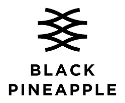

# Deep Calendar Recommendation

고객의 일정/취향에 맞는 의상을 추천함 (User-based Collaboration-Filltering)  
 1. 고객의 일정 특성에 따라 의상을 필터링
 2. 의상별 사용자별 별점을 이용하여 사용자들의 취향 유사도를 계산함
 3. 유사도가 가장 높은 다른 사용자가 별점을 높게 준 의상을 추천함
  
## Recommendation Algorithm
> 
> 

## How to get Data

## Tutorial

## License

