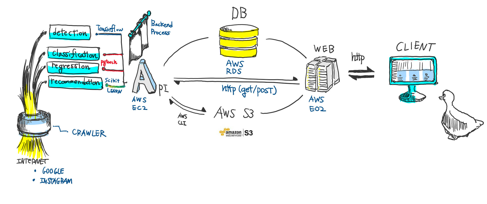

# 깊은 달력 (a.k.a. Deep Calendar)

#### 사용자의 일정과 취향을 고려하여, 옷을 추천해주는 깊고 멋진 서비스
`삼성 인공지능 해커톤`(https://research.samsung.com/aichallenge) 최종 우승작입니다.

사용자의 `일정`과 `옷`을 등록하면 일정을 분석하여 알맞은 옷 세벌을 추천하여 줍니다.

깊은 달력이 깊이 고민하여 골라준 3벌 중 가장 마음에 드는 옷을 입고 가시면 됩니다.

#### 서비스에 대한 조금 더 친절한 설명
> 아래 과정을 클릭하시면 더욱 상세한 설명으로 이어집니다
1. [선호 의상 등록을 통한 취향 분석과 자기 소유 의상 등록](#선호-의상-등록을-통한-취향-분석과-자기-소유-의상-등록)
2. [일정 등록](#일정-등록)
3. [일정별로 추천 의상 상하의 3 세트 추천](#일정-별로-추천-의상-상하의-3-세트-추천)
4. 옷을 입고 노래와 춤을 추면서 약속된 장소로 날아간다.

## 왜 만들었나요?
사람들은 매일 아침 오늘 뭐입지? 에 대한 고민을 합니다.
특히 소개팅, 결혼식, 미팅 등 중요한 일정이 있을 땐, 고민의 강도가 더 심해집니다.
가족 혹은 친구에게 패션을 조언 받기도 하겠지만, 매일 조언을 얻는 것은 서로에게 매우 피곤한 일입니다.

**깊은 달력**은 일정을 기반으로 해당 일정에 어울리는 패션을 추천합니다.
사용자는 자신의 취향을 입력하고 일정을 등록하면 매일 아침 오늘에 어울리는 패션을 추천받을 수 있습니다.

## 프로젝트 구성요소

##### 1. Crawler
> 딥러닝 모델 학습용 이미지 모으기 
> 1. 구글 검색 이미지
> 2. 인스타그램 이미지
##### 2. Detection
> 크롤러에서 수집한 이미지에서 상의(top)/하의(bottom)를 Object Detection(tensorflow-Faster RCNN), 잘라낸 이미지를 저장하여 이후 과정 학습에 사용함.
> (ref : https://github.com/EdjeElectronics/TensorFlow-Object-Detection-API-Tutorial-Train-Multiple-Objects-Windows-10)
##### 3. Classification
> 옷의 이미지를 보고 옷을 세부 카테고리로 분류함
> 1. 옷 종류 - T-shirt / pants / coat ..etc
> 2. 일정 - daily / school / party ..etc
> 3. 날씨 - sunny / rain / cloudy / snow
##### 4. Regression
> 옷의 이미지를 보고 옷에 특정 점수를 부여함
> 1. 온도 - 옷을 입기에 적합한 최저 온도 / 최고 온도 제공
> 2. 매칭도 - 상의 / 하의 한 세트의 옷이 얼마나 어울리는지를 점수를 부여
##### 5. Recommendation
> 고객의 일정/취향에 맞는 의상을 추천함 (User-based Collaboration-Filltering)  
> 1. 고객의 일정 특성에 따라 의상을 필터링
> 2. 의상별 사용자별 별점을 이용하여 사용자들의 취향 유사도를 계산함
> 3. 유사도가 가장 높은 다른 사용자가 별점을 높게 준 의상을 추천함
##### 6. API (Python Flask 기반의 API 서버)
> [API List]
> 1. S3download('fromfile', 'tofilename') : Image 서버의 자원을 로컬로 다운로드
> 2. detectImage('detectImName') : 이미지 Detection 및 crop 하여 Image 서버에 저장 후 URL 반환
> 3. ClassificateImage('imName') : 이미지를 의상 카테고리/일정 카테고리/날씨/온도에 따라 분류하여 태그 반환
> 4. RecommendClothes : 추천 필요 일정을 확인 후, 일정별 추천 의상 매핑 
> 5. matchImage('imTopName','imBottomName','imTopCode','imBottomCode') : 상의와 하의를 입력하여 매칭률을 반환
##### 7. Web
> Spring Framework 기반 웹서버 구축
> 1. 사용자 등록, 로그인
> 2. 옷장 본인이 소유한 옷 등록 (등록시 사진을 분석하여 옷을 분석하여 상,하의 사진을 분리함)
> 3. 캘린더 추천을 받을 일정을 해당하는 이벤트 특성(파티, 여행) 등을 선택하여 등록
> 4. 등록 후 API 서버에서 분석하여 추천 의상이 등록되며 일정 상세에서 확인가능
##### 8. DB
> AWS MARIADB 10 사용
> 웹서버의 사용자, 일정, 옷 정보 등을 등록
> API 서버에서 해당 일정을 분석하여 옷 추천
##### 9. Image Server
> AWS S3를 이용하여 Static Image 서버 구축(https 이미지 호스팅)
> AWS CLI를 각 서버에서 접근

## 어떻게 사용하나요?

### 1. 어떤 환경에서 써야하는지 (Dependencies)
> !!!!!!경고!!!!!!! 매우 깁니다! 필요한 정보를 그때그때 찾아보시고 바로 다음으로 넘어가서 읽으시는 것을 권장드립니다!

#### 리눅스 정보 확인
   * 커널 : uname -a
   * os version : cat /etc/*release*
   * bit : getconf LONG_BIT

#### 파이썬 정보 확인
   * PIP 버전확인 : python3 -V
   * PIP 설치
      * apt-get update
      * sudo apt-get install python3-pip
   * PIP Upgrade : sudo pip install --upgrade pip

#### 가상환경 설정
   * virtualenv 설치 : pip3 install virtualenv
   * python3.5 위치 확인 : which python3.5
   * 가상환경 생성 : virtualenv -p 'which python3.5' 가상환경이름
   * 가상환경 활성화 : source 가상환경이름/bin/activate 
   * 가상환경 비활성화 : deactivate

#### 라이브러리 설치 (in 가상환경)
##### 기본
   * sudo apt-get update
   * sudo apt-get upgrade
   * sudo apt-get dist-upgrade
   * sudo apt-get autoremove

##### cv2
   * sudo apt-get install build-essential cmake git libgtk2.0-dev pkg-config libavcodec-dev libavformat-dev libswscale-dev
   * sudo apt install python-opencv
   * pip install opencv-python
   * tensorflow-gpu 

#### Adds NVIDIA package repository.
   * sudo apt-key adv --fetch-keys http://developer.download.nvidia.com/compute/cuda/repos/ubuntu1604/x86_64/7fa2af80.pub
   * wget http://developer.download.nvidia.com/compute/cuda/repos/ubuntu1604/x86_64/cuda-repo-ubuntu1604_9.1.85-1_amd64.deb
   * wget http://developer.download.nvidia.com/compute/machine-learning/repos/ubuntu1604/x86_64/nvidia-machine-learning-repo-ubuntu1604_1.0.0-1_amd64.deb
   * sudo dpkg -i cuda-repo-ubuntu1604_9.1.85-1_amd64.deb
   * sudo dpkg -i nvidia-machine-learning-repo-ubuntu1604_1.0.0-1_amd64.deb
   * sudo apt-get update

> ##### Includes optional NCCL 2.x.
   * sudo apt-get install cuda9.0 cuda-cublas-9-0 cuda-cufft-9-0 cuda-curand-9-0 \
   * cuda-cusolver-9-0 cuda-cusparse-9-0 libcudnn7=7.1.4.18-1+cuda9.0 \
   * libnccl2=2.2.13-1+cuda9.0 cuda-command-line-tools-9-0

##### Optionally install TensorRT runtime, must be done after above cuda install.
   * sudo apt-get update
   * sudo apt-get install libnvinfer4=4.1.2-1+cuda9.0
   * CUDA toolkit and Nvidia drivers
   * sudo apt-get install linux-headers-$(uname -r)
   * sudo apt-get install mesa-utils
   * sudo dpkg -i ./cuda-repo-ubuntu1604_9.1.85-1_amd64.deb
   * sudo apt-get update
   * sudo apt-get install cuda-9-1
   * sudo apt-get autoremove
   * reboot
   * pip install --ignore-installed --upgrade tensorflow-gpu
   * nvidia 스펙 확인 : nvidia-smi

#### protobuf 설치
   * sudo apt-get install autoconf automake libtool curl make g++ unzip
   * git clone https://github.com/google/protobuf.git
   * cd protobuf
   * git submodule update --init --recursive
   * ./autogen.sh
   * ./configure
   * make
   * make check
   * sudo make install
   * sudo ldconfig # refresh shared library cache.

`Numpy` : pip install numpy
`pil` : pip install Pillow
`scipy` : pip install scipy
`sklearn` : pip install scikit-learn
`lxml` : pip install lxml
`Cython` : pip install Cython
`matplotlib` : pip install matplotlib
`pandas` : pip install pandas

#### PATH 설정 (for ubuntu)
   * export PYTHONPATH=/jet/prs/workspace/tensorflow1/models/research:$PYTHONPATH 
   * export PYTHONPATH=/jet/prs/workspace/tensorflow1/models/research/slim:$PYTHONPATH 
   * `(for rhel fedora)` : export PYTHONPATH="${PYTHONPATH}:/home/ubuntu/tensorflow1/models;${PYTHONPATH}:/home/ubuntu/tensorflow1/models/research;${PYTHONPATH}:/home/ubuntu/tensorflow1/models/research/slim"
   * `(for windows)` :set PYTHONPATH=C:\tensorflow1\models;C:\tensorflow1\models\research;C:\tensorflow1\models\research\slim

#### 실행
   * python legacy/train.py --logtostderr --train_dir=training/ --pipeline_config_path=training/faster_rcnn_inception_v2_pets.config

#### AWS CLI (https://docs.aws.amazon.com/ko_kr/cli/latest/userguide/awscli-install-linux.html)
   * sudo pip install awscli --upgrade --user
   * aws --version
   * aws configure

#### AWS S3 CLI 명령어 (https://docs.aws.amazon.com/ko_kr/cli/latest/userguide/cli-s3.html)
`s3 버킷 목록 조회` : aws s3 ls
`s3 버킷 상세 조회` :  aws s3 ls s3://mybucket
`s3 버킷 폴더 조회` :  aws s3 ls s3://mybucket/myfolder
`업로드/다운로드` :  aws s3 cp from_folder to_folder --recursive

### 2. 프로젝트를 구동시키기 위한 과정
> 프로젝트 각 칸 readme에 상세한 과정이 안내되어 있습니다.
   1. 이미지 Data 수집 (Selenium을 이용한 Web Crawling)
   2. Detection 분류기 학습을 위한 이미지의 레이블 생성
   3. Object Detection Model 학습
   4. Classification / Regression Model 학습
   5. 의상 평점 Data 수집 (Web Crawling) 및 DB 저장
   6. Recommendation Model 학습
   7. API 서버 구축
   8. Web 서버 구축

## Appendix

### 1. 서비스 설명
#### 선호 의상 등록을 통한 취향 분석과 자기 소유 의상 등록
 > 1. 사용자는 자신의 취향을 등록합니다.
 > 2. 그리고 자신의 옷장에 있는 옷을 사진으로 등록합니다.
 > 3. 사진에서 상/하의가 있는 부분을 찾아내서 각각 따로 저장합니다. (Object Detection)
 > 4. 상/하의의 특성을 태깅합니다. (Classification: 일정/온도/날씨/옷카테고리)
 
#### 일정 등록
 > 5. 사용자가 일정을 등록합니다.

#### 일정별로 추천 의상 상하의 3 세트 추천
 > 6. 사용자의 옷에 일정에 적합한 지에 대한 점수를 부여합니다.
 > 7. 일정마다 옷에 점수가 상이하게 매겨집니다.
 > 8. 일정별로 높은 점수를 부여받은 옷에 한하여 사용자의 취향에 적합한지 분석하여 가장 적합한 옷을 선택합니다.
 > 9. 일정별로 선택된 상하의 옷을 기반으로 가장 어울리는 상하의 조합을 찾아냅니다.
 > 10. 최종적으로 선택된 상하의 세트 3개를 추천합니다.

[위 서비스 설명으로 돌아가기](#서비스에-대한-조금-더-친절한-설명)

### 2. 옷 추천 및 선별 과정
1. 추천 알고리즘에 의해 해당 유저의 취향 옷 1차 선별
2. 선별된 옷 중 유저가 입력한 일정 정보에 적합한 옷 2차 선별
3. 2차 선별을 통과한 옷 중에서 가장 어울리는 상의 하의 조합을 찾아내어서 추천

### 3. 서비스 아키텍쳐

## License
MIT License

Copyright (c) 2019 illgamho_duck(Park, Hyun-byung), misoA(Park Miso), mega117(Kyung min Kim)

Permission is hereby granted, free of charge, to any person obtaining a copy of this software and associated documentation files (the "Software"), to deal in the Software without restriction, including without limitation the rights to use, copy, modify, merge, publish, distribute, sublicense, and/or sell copies of the Software, and to permit persons to whom the Software is furnished to do so, subject to the following conditions:

The above copyright notice and this permission notice shall be included in all copies or substantial portions of the Software.

THE SOFTWARE IS PROVIDED "AS IS", WITHOUT WARRANTY OF ANY KIND, EXPRESS OR IMPLIED, INCLUDING BUT NOT LIMITED TO THE WARRANTIES OF MERCHANTABILITY, FITNESS FOR A PARTICULAR PURPOSE AND NONINFRINGEMENT. IN NO EVENT SHALL THE AUTHORS OR COPYRIGHT HOLDERS BE LIABLE FOR ANY CLAIM, DAMAGES OR OTHER LIABILITY, WHETHER IN AN ACTION OF CONTRACT, TORT OR OTHERWISE, ARISING FROM, OUT OF OR IN CONNECTION WITH THE SOFTWARE OR THE USE OR OTHER DEALINGS IN THE SOFTWARE.

