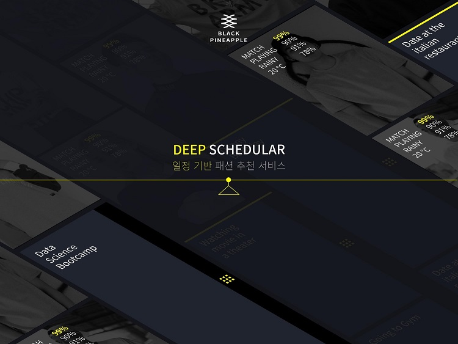

# 깊은 달력 (a.k.a. Deep Calendar)

## 깊은 달력 소개

##### 사용자의 일정과 취향을 고려하여, 옷을 추천해주는 깊고 멋진 서비스

**주의** 
_소스코드 업로드와 readme 수정을 진행중입니다
완성본이 아닙니다_

#### 왜 만들었나요?
___
사람들은 매일 아침 오늘 뭐입지? 에 대한 고민을 합니다.
특히 소개팅, 결혼식, 미팅 등 중요한 일정이 있을 땐, 고민의 강도가 더 심해집니다.
가족 혹은 친구에게 패션을 조언 받기도 하겠지만, 매일 조언을 얻는 것은 서로에게 매우 피곤한 일입니다.

**깊은 달력**은 일정을 기반으로 해당 일정에 어울리는 패션을 추천합니다.
사용자는 자신의 취향을 입력하고 일정을 등록하면 매일 아침 오늘에 어울리는 패션을 추천받을 수 있습니다.

#### 어떻게 쓰나요?
___
지금 당장은 사용하실 수 없습니다.
BUT, **★ STAR**를 클릭 하신 후 **깊은 달력** github를 clone or download 하여 아래의 튜토리얼을 따라오신다면
여러분은 충분히 멋지고 깊은 달력을 사용하실 수 있습니다

## 깊은 달력의 인공지능
깊은 달력은 Python 기반의 기본적인 인공지능 기술들을 학습시켰습니다.

깊은 달력은 다음과 같은 흐름으로 동작합니다.
1. 사용자는 자신의 취향을 등록합니다.
2. 그리고 자신의 옷장에 있는 옷을 사진으로 등록합니다.
3. 사진에서 상/하의가 있는 부분을 찾아내서 각각 따로 저장합니다. (Object Detection)
4. 상/하의의 특성을 태깅합니다. (Classification: 일정/온도/날씨/옷카테고리)
5. 사용자가 일정을 등록합니다.
6. 사용자의 옷에 일정에 적합한 지에 대한 점수를 부여합니다.
7. 일정마다 옷에 점수가 상이하게 매겨집니다.
8. 일정별로 높은 점수를 부여받은 옷에 한하여 사용자의 취향에 적합한지 분석하여 가장 적합한 옷을 선택합니다.
9. 일정별로 선택된 상하의 옷을 기반으로 가장 어울리는 상하의 조합을 찾아냅니다.
10. 최종적으로 선택된 상하의 세트 3개를 추천합니다.

1. 추천 알고리즘에 의해 해당 유저의 취향 옷 1차 선별
2. 선별된 옷 중 유저가 입력한 일정 정보에 적합한 옷 2차 선별
3. 2차 선별을 통과한 옷 중에서 가장 어울리는 상의 하의 조합을 찾아내어서 추천

### 기술 설명하는 방법
1. 기술 개요
2. 데이터 수집 방법
3. 학습 방법
4. 학습 테스트

** 등록 **
Reference : https://github.com/EdjeElectronics/TensorFlow-Object-Detection-API-Tutorial-Train-Multiple-Objects-Windows-10

- Object Detection (Faster RCNN)
    1. 유저가 새로 등록하는 옷에 적용
    2. 기존 미리 등록된 옷들은 이 과정을 통과함

** Tagging **
Reference : https://github.com/IllgamhoDuck/CVND/tree/master/%40PROJECT%20%5BImage%20Captioning%5D
1. 옷 카테고리
2. 날씨
3. 일정별
4. 온도
5

** 점수 매기기 ** (유저가 등록한 일정에 특정 옷이 얼마나 어울리는지 점수로 표시하는 방법)
예로 A, B라는 옷이 있다고 하자. A, B옷의 태깅은 다음과 같이 매겨졌다.

| 날씨 | A | B |
|--------|--------|--------|
| 맑음       | 5%       | 91%       | 
| 흐림       | 15%       | 4%       |
| 비       | 15%       | 2%       |
| 눈       | 65%       | 3%       |
일정에 눈이 온다고 쓰여있으면, A의 옷이 B의 옷보다 눈에 더 어울리므로 A의 옷이 선택되게 된다.
위의 예시는 날씨 하나에만 적용시킨 예시다. 위와 같이 일정이 주어졌을 때 옷에 매기는 점수는
날씨 뿐만 아니라 일정 카테고리별(여행, 비즈니스, 학교 등), 온도(예로 15도) 등을 고려하여 평가한다.

** 추천 **
- 옷 추천 알고리즘

** 매칭 **
- 옷 매칭 찾아내기

## License

